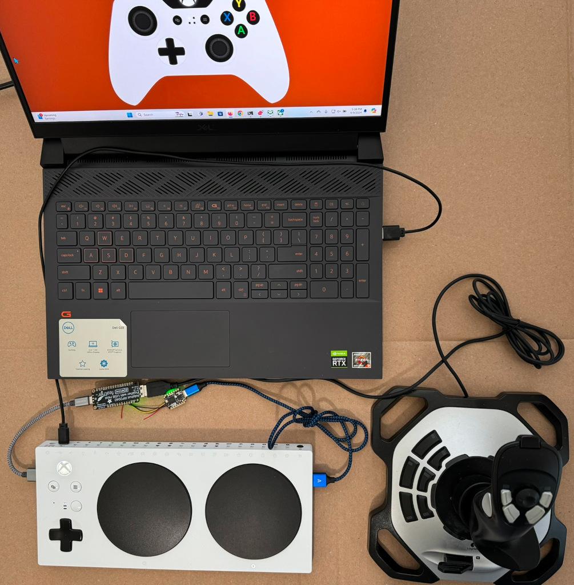
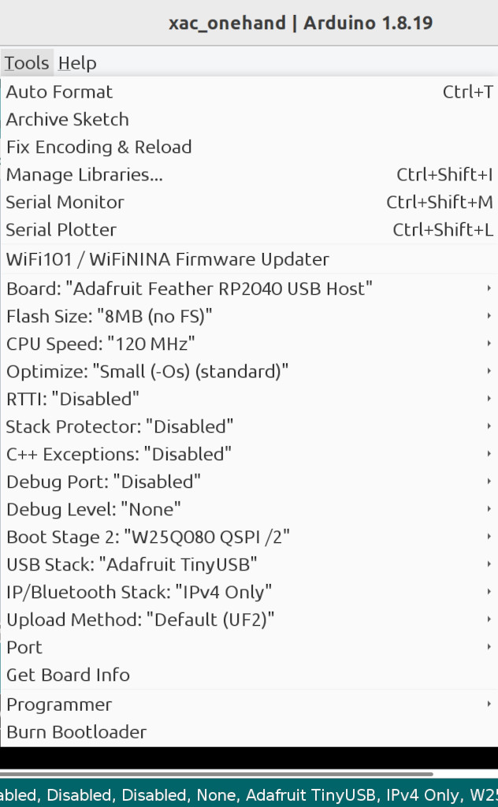

# Xbox Adaptive Controller Flight Joystick

xac_onehand connects a USB flight stick such as a Logitech Extreme 3D Pro to
both USB ports on an Xbox Adaptive Controller (XAC). This is useful for one
handed players to play two joystick games.

This project was inspired by an older XAC joystick splitter project. This
project uses newer boards and is simplified by using QWIIC/Stemma QT to connect
the boards. No soldering is needed.

Note the cut red wire. More below. The wire ends are left flying to make clear
in the photo the red wire is cut. The ends should be trimmed closer to connectors.

## Easy Build for Two Logitech Flight Sticks

This works with the Logitech Extreme 3D Pro and the Logitech X52 H.O.T.A.S.
joysticks. No soldering. The Thrustmaster joystick does not work with this
configuration.

* 1 X Adafruit QT Py RP2040
* 1 X QWIIC/Stemma QT cable
* 1 X Adafruit Feather RP2040 with USB Type A Host
* 1 X [Adafruit Case](https://learn.adafruit.com/case-for-feather-rp2040-usb-host)

The Feather RP2040 with USB Type A Host board plugs in to the XAC left USB
port. The flight stick X and Y axes control the XAC left thumb stick.

The QT Py RP2040 plugs in to the XAC right USB port. The flight stick Z/twist
axis controls the right thumb stick X axis. The flight stick hat switch forward
and backward control the right thumb stick Y axis.

The RP2040 USB host sends joystick parameters to the QT Py over the
QWIIC/Stemma QT I2C port. The QT Py relays the joystick parameters out its USB
port.

## Warning! Cut the red wire.

Cut the red wire on the QWIIC cable to avoid damaging the boards. Both boards
are sourcing power on the QWIIC red wire. Power outputs should never be
connected to each other. Both boards are powered from their USB connectors so
there is no need for power from the QWIIC cable. 

## Software/firmware UF2 files

### Adafruit QT Py RP2040

Burn this UF2 file into the QT Py RP2040.

./uf2/i2c_demo_rx.ino.adafruit_qtpy_rp2040.uf2

This explains how to put the board in bootloader mode. When the USB drive
RPI-RP2 appears, drag and drop the UF2 file on the drive.

https://learn.adafruit.com/adafruit-qt-py-2040/pinouts#buttons-3091444

### Adafruit Feather RP2040 with USB Type A Host

./uf2/xac_onehand.ino.adafruit_feather_usb_host.uf2

This explains how to put the board in bootloader mode. When the USB drive
RPI-RP2 appears, drag and drop the UF2 file on the drive.

https://learn.adafruit.com/adafruit-feather-rp2040-with-usb-type-a-host/pinouts#buttons-and-rst-pin-3143253

### How to build xac_onehand source code

This is optional because compiled code is available in the uf2/ folder.

Note the following options must be changed from the default values.

* The "CPU Speed" option is set to "120 MHz".
* The "USB Stack: option is set to "Adafruit TinyUSB".

The Arduino IDE 1.8.19 is used but newer versions should also work.

Install the following libraries using the IDE library manager.

* Adafruit TinyUSB Library
* Pico PIO USB

Install a ZIP file from https://github.com/touchgadget/flight_stick_tinyusb then install
the library using the IDE "Install ZIP Library".

## Miscellaneous

### Case For Feather RP2040 USB Host

https://learn.adafruit.com/case-for-feather-rp2040-usb-host

### Map the joystick trigger button to right bumper

This can be done on Windows and Xbox console.

https://www.youtube.com/watch?v=gm4w4qXaDm8

https://youtu.be/gm4w4qXaDm8?t=196
